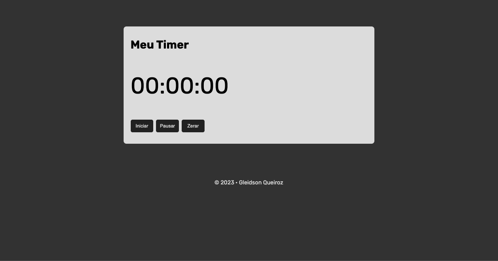

# 💻 #Meu Timer

[🚀 Acesse aqui](https://queiiroz.github.io/meu-timer/)

## 💻 O exercício

Exercício do curso de JS da Udemy, fazer um timer com botão de iniciar, parar e zerar.

## 🛠 Tecnologias

- HTML
- CSS
- JavaScript
- Git
- GitHub

<table>
  <tr>
    <td>
     
    </td>
    <td>
      Feito por Gleidson Queiroz.</a> 🙋🏼‍♂️
    </td>
  </tr>
</table>
